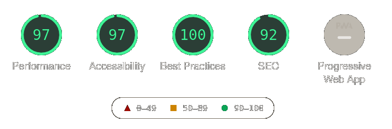

# gatsby-starter-github

  

<h1></h1>

> Bootstrap a customized GitHub repository showcase

Define **GITHUB_TOKEN** environment variable with your corresponding GitHub personal access token before running.
